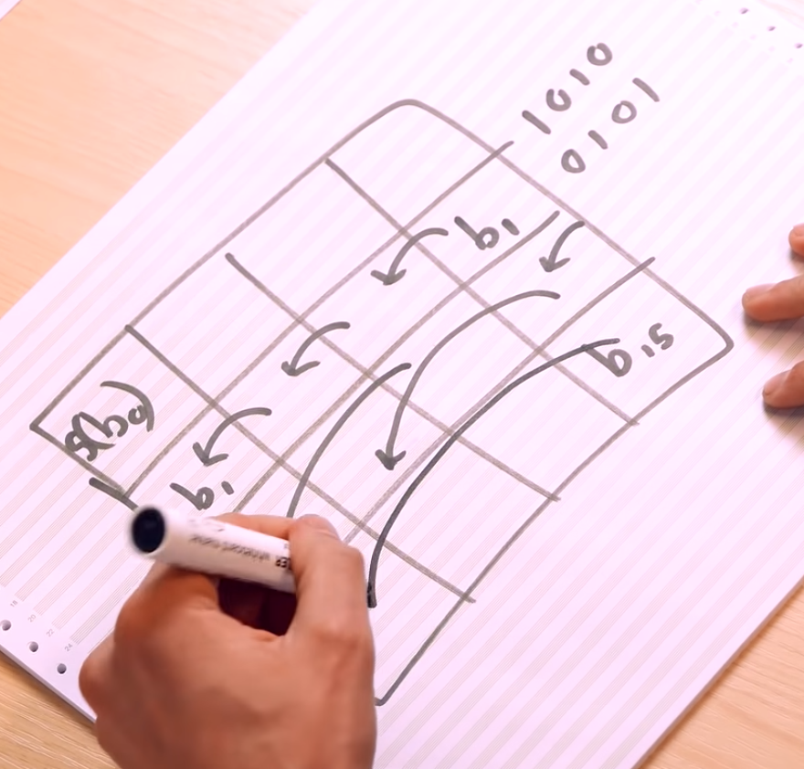

# Write or Implement a Cipher

Your cipher should both encrypt and decrypt a message. Your cipher may be one of your own construction or a common one of any strength you find on the Internet (from Caesar or Vigenere to FIP 140-2 ciphers such as AES).

You must include your code and sample runs including screenshots. If you implement a known cipher, it will have test inputs for verification and those should be used.

## Chosen cipher: AES

I'm taking some notes on how the AES (Advanced Encryption Standard) cipher algorithm works below, using [this video](https://www.youtube.com/watch?v=O4xNJsjtN6E) as a reference.
128 bit symmetric block cipher
takes 128 bits of message converts into 128 bits of ciphertex with some key
key can be 128, 192, or 256 bits.

You have a 4x4 grid, byte0 through 3 in first column, 4 through 7 in second column, etc.
Everything AES happens on that grid

When you have a 128-bit key, you have 10 rounds. When you have a 192-bit key, you have 12 rounds. When you have a 256-bit key, you have 14 rounds.
The key ends up getting expanded into N+1 chunks, or _round keys_, where N is the number of rounds. So 11 round keys with 128-bit key, 13 round keys for 192-bit key, and 15 round keys for 256-bit key.

AES is now built into hardware; inherently on Intel chips, AMD chips;

1. Start with plaintext
2. Expand key into different round keys using a **key schedule**
   1. Explained quite well here: [https://www.youtube.com/watch?v=rmqWaktEpcw](https://www.youtube.com/watch?v=rmqWaktEpcw)
3. Use part of key ($k_0$) for XOR operation
4. Then do round:
   1. Substitute bytes
      1. Each byte mapped to a different byte in a lookup table within finite field. This mapping is very non-linear, so it's hard to represent mathematically.
      2. There are no fixed points, so no byte is substituted with itself (as you'd see in the random substitution cipher).
      3. There are no _opposite_ fixed points, meaning there are no substitutions that simply flip each bit.
      4. Within 4x4 grid, each cell is a byte; replace each cell with substituted byte.
         1. 
   2. Shift rows
      1. Don't shift first row. Shift second row one to the left; shift third row two to the left; shift fourth row 3 to the left.
         1. 
   3. Mix columns
      1. Similar to above, but column-wise mixing for each column. Mixing is done with matrix multiplication. There's a reverse inverse matrix that does the exact opposite when you want to decrypt as well.
      2. Don't mix columns in final round because it doesn't do anything useful.
      3. Referenced Design of Rijndael section 4.1.2
         1. 
      4. Also referenced Design of Rijndael section 4.1.3 for decryption/inverse mix columns
         1. 
   4. Add round key
      

AES in a nutshell is built on repeated rounds of "SP" - substitution and permutation. The substitution is defined by an "S-box", basically the map of bytes with their respective substitute bytes. AES happens to be built on the Rijndael S-box, seen here:

Then, for decryption, there is the inverse S-box:

